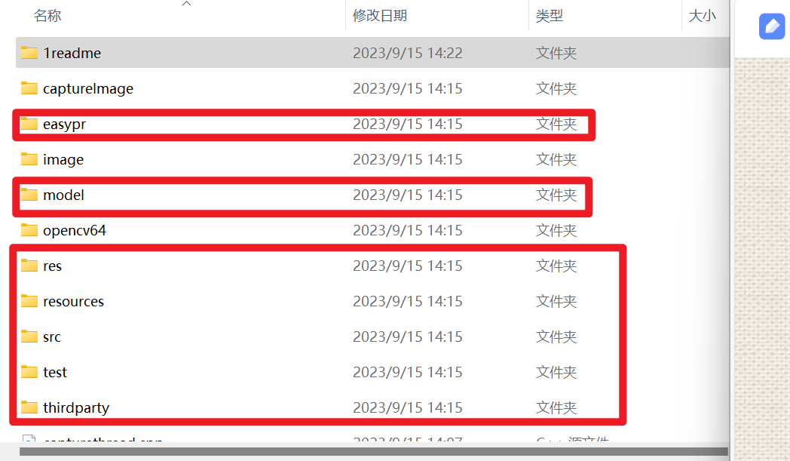
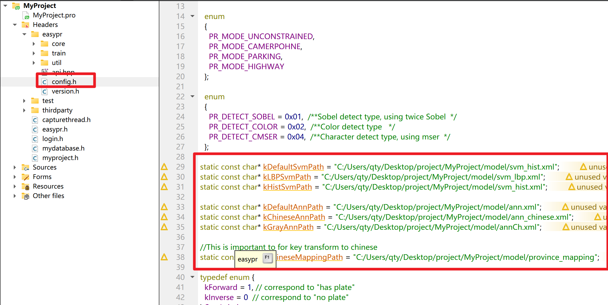
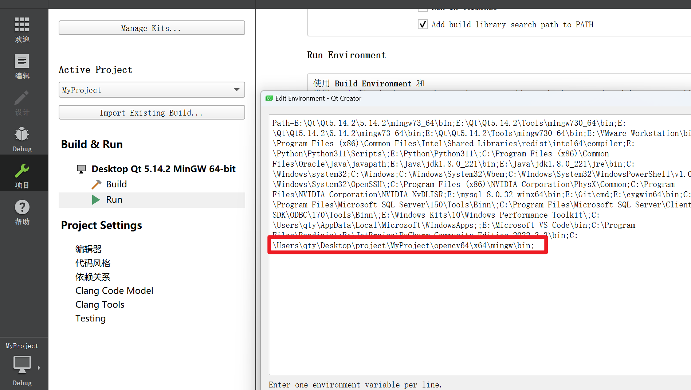
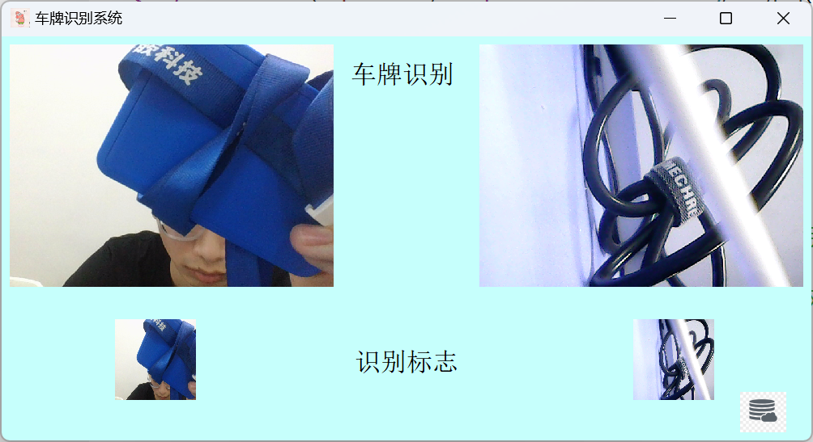
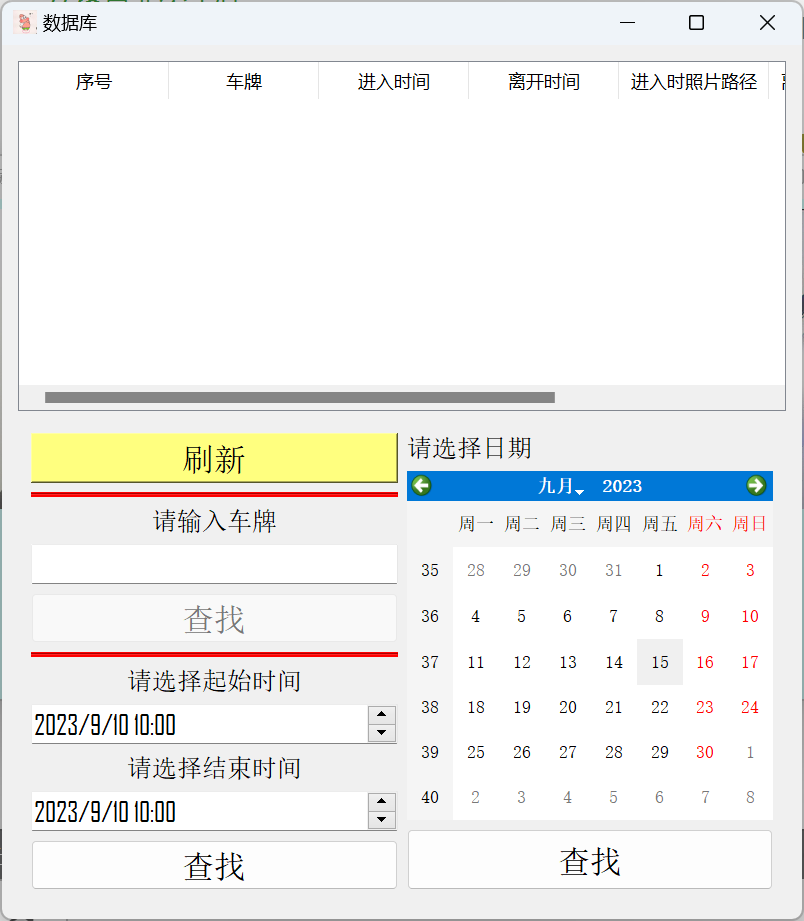
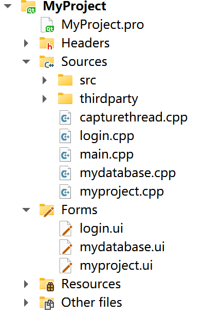

# 停车场管理系统（qt+opencv）

利用摄像头进行对车牌的识别，记录进出入时间差，计算费用，保存照片，把数据加入到sqlite数据库中，可以进行对数据库中数据进行查找

以上文件为github项目文件

EasyPR是一个基于opencv的开源的车牌识别项目，使用参考

https://github.com/liuruoze/EasyPR

https://www.jianshu.com/p/22617e584f28

修改路径地址

配置opencv环境

# 功能描述

定时器没0.7秒截图，截图完成发送信号，发送给识别的槽函数，识别函数进行识别，并对数据库经常增加或者修改操作
数据库界面记录了 车牌 进出入时间 进出入拍照保存到的路径 收费情况
点击数据库界面的保存照片路径可查看保存的照片
可以根据车牌  具体时间段  日期 进行查找

# 模块简介

- capturethread.cpp 为主要识别

- login 为登录数据库界面操作

- main.cpp 为qt自动生成 没做更改

- mydatabase 为数据库的操作（显示、查找）

- myproject 为程序的主界面操作

    

